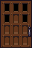
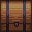
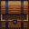

# Personajes secundarios u objetos

## Atea 
La puerta de la casa del Arquitecto. Se puede interactuar con ella al terminar el juego para entrar en la casa:

## Baul
Baul que obtiene una pieza de ordenador

