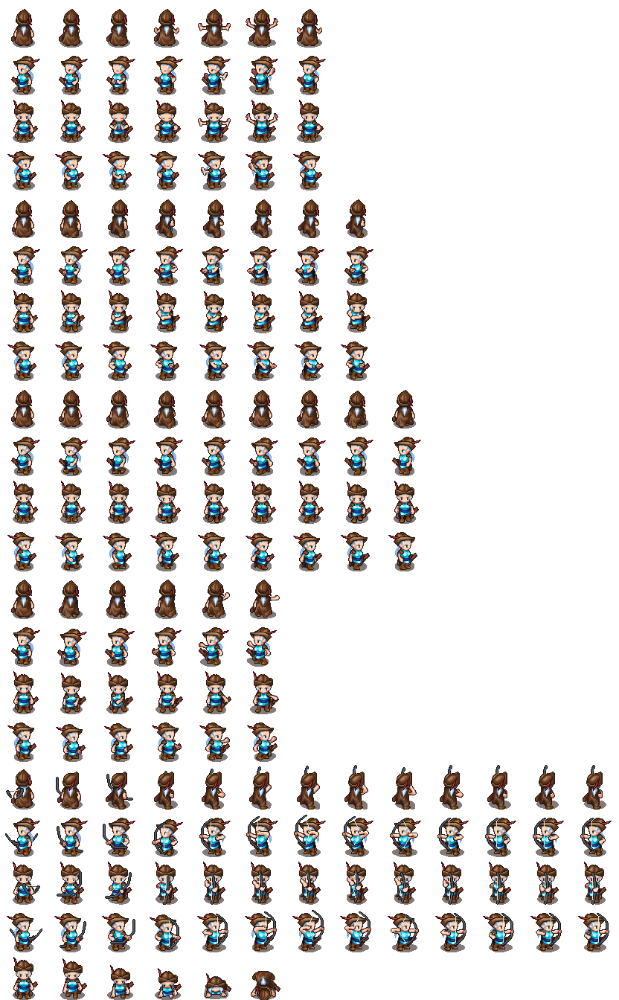
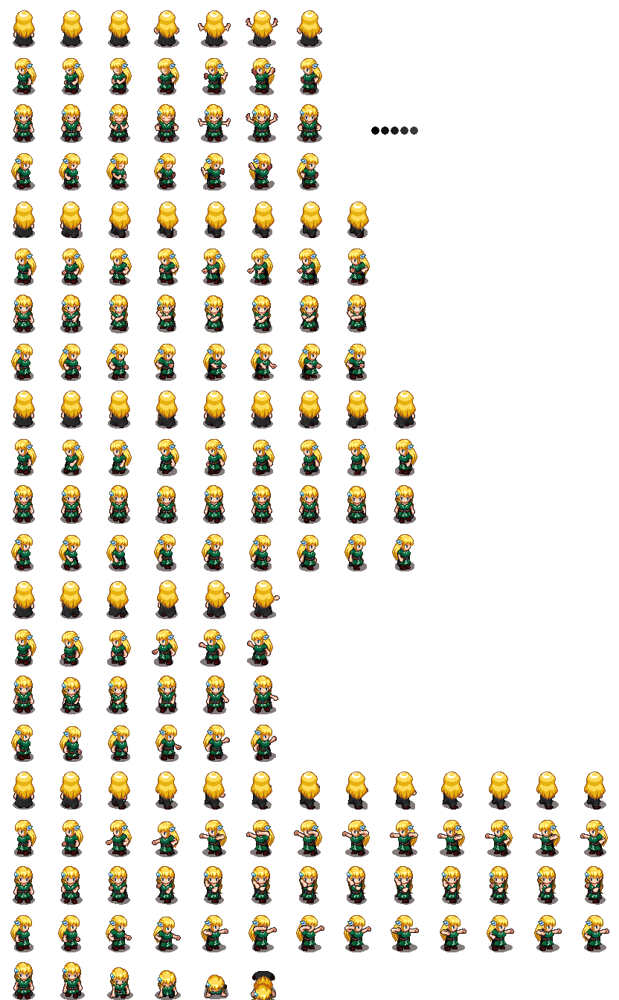
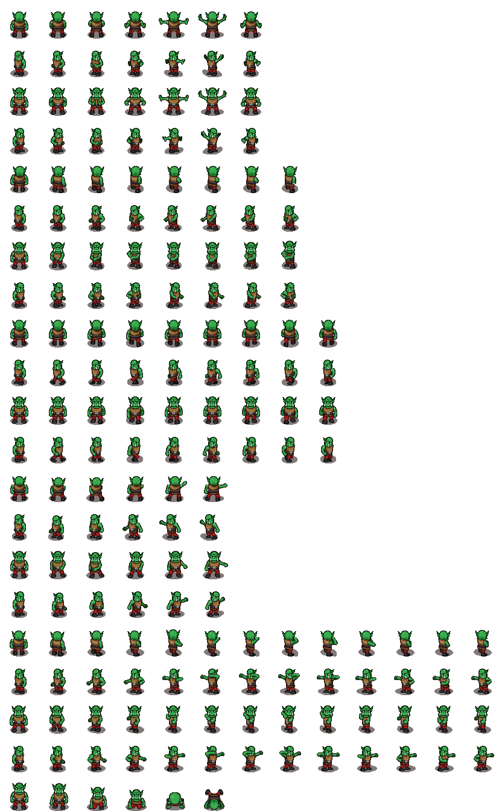
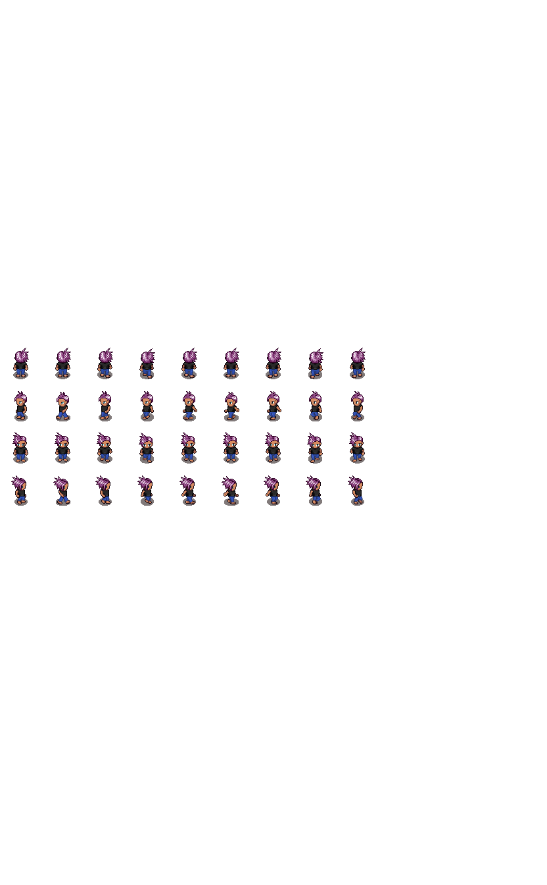

# Personajes con los que interactuar
Son los personajes que nos darán las piezas. Los textos en [testu.txt](testu.txt)

## Archer
[Generator](https://sanderfrenken.github.io/Universal-LPC-Spritesheet-Character-Generator/#?body=white&shadow=1&sex=female&hat=cap_leather&ears=elven&hair=ponytail_white_cyan&boots=boots_brown&clothes=sara&weapon=recurvebow&quiver=on&cape=blue&=cape_brown&shoulders=leather)

## Neska
[Neska](https://sanderfrenken.github.io/Universal-LPC-Spritesheet-Character-Generator/#?sex=female&shadow=1&dress=dress_black&legs=Pants_black_L&boots=boots_dark&clothes=dress_sash&=cape_black&belt=leather&hair=sara&hairsara-toplayer=1&hairsara-shadow=1&hairsara-bottomlayer=1)

## Orco
[Generator](https://sanderfrenken.github.io/Universal-LPC-Spritesheet-Character-Generator/#?body=orc3&legs=pants_red&shoes=boots_black1&armor=chest_leather)

## Umea
[Generator](https://sanderfrenken.github.io/Universal-LPC-Spritesheet-Character-Generator/#?sex=male&body=child_walk_olive&legs=Child_pants_blue&clothes=Child_shirt_black&hair=Child_hair_halfmessy_default&childshadow=1)

